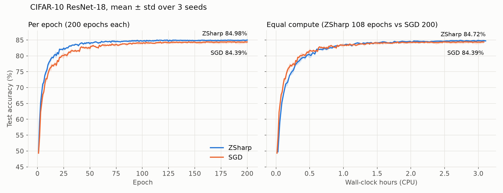

# ZSharp

[](https://colab.research.google.com/github/bangyen/zsharp/blob/main/zsharp_demo.ipynb)
[](https://github.com/bangyen/zsharp/actions/workflows/ci.yml)
[](LICENSE)

**Sharpness-Aware Minimization with Z-Score Gradient Filtering: +0.59% accuracy over SGD at 200 epochs (+2.65% at 20), fully reproducible**

<p align="center">
  
</p>

## Quickstart

Clone the repo and run the demo:

```bash
git clone https://github.com/bangyen/zsharp.git
cd zsharp
pip install -e .
pytest   # optional: run tests
python -m scripts.train --config configs/zsharp_baseline.yaml
```

Or open in Colab: [Colab Notebook](https://colab.research.google.com/github/bangyen/zsharp/blob/main/zsharp_demo.ipynb).

## Results

| Scenario / Dataset | Epochs | Baseline (SGD) | This Project | Δ Improvement |
|--------------------|--------|----------------|--------------|---------------|
| CIFAR-10 ResNet-18 | 20     | 78.19 ± 0.23%  | **80.84 ± 0.54%** | +2.65%   |
| CIFAR-10 ResNet-18 | 50     | 82.36 ± 0.88%  | **83.81 ± 0.18%** | +1.45%   |
| CIFAR-10 ResNet-18, strong reg.† | 50 | 80.18 ± 0.08% | **83.49 ± 0.30%** | +3.31% |
| CIFAR-10 ResNet-18 | 200    | 84.39 ± 0.48%  | **84.98 ± 0.36%** | +0.59%   |
| CIFAR-10 ResNet-18, strong reg.† | 200 | 85.62 ± 0.34% | **86.38 ± 0.43%** | +0.76% |
| CIFAR-100 ResNet-18 | 20 | 48.59 ± 0.51% | **50.75 ± 0.49%** | +2.16% |

*Final test accuracy, mean ± std over 3 seeds (42, 1, 2). 200 epochs:
`python -m scripts.sweep --epochs 200 --seeds 42 1 2 [--regularize]`. The
50-epoch rows are epoch 50 of those runs, which match a 50-epoch run exactly
since the LR schedule does not depend on the total. Baseline:
`configs/sgd_baseline.yaml`. ZSharp:
`configs/zsharp_baseline.yaml` (paper hyperparameters: AdamW, batch size 256,
$Q_p = 0.95$), with `epochs` set as shown. Measured on CPU.
† `label_smoothing: 0.1` and `strong_augmentation: true` (TrivialAugmentWide
plus random erasing). Both models underfit at 50 epochs under this
regularization (~70% train accuracy), so it lowers accuracy for both, but
the per-epoch gap widens; by 200 epochs it raises both (+1.2% SGD, +1.4%
ZSharp) and ZSharp leads on every seed.*

> **Note**: the gap shrinks with training — ZSharp reaches its plateau
> sooner, but both end within about a point. Each ZSharp step costs two
> forward/backward passes plus the Z-score filtering; one ZSharp epoch takes
> ~1.9x as long as an SGD epoch (127 s vs 68 s on 4 CPU threads). Given the
> same compute as 200 SGD epochs, 108 ZSharp epochs reach 84.72 ± 0.23% vs
> SGD's 84.39 ± 0.48% (last-10-epoch means 84.74% vs 84.35%; ZSharp ahead on
> every seed). SGD leads for roughly the first 40% of that budget; see the
> right panel of the figure above. With strong regularization the
> equal-compute result is 86.04 ± 0.40% vs 85.62 ± 0.34%. A 200-epoch ZSharp
> run takes ~5.7 h at the current per-epoch cost.

## Features

- **Z-Score Gradient Filtering** — Layer-wise Z-score normalization with a global 95th percentile threshold (configurable), matching the paper's $Q_p = 0.95$.
- **Device Support** — Runs on CUDA, Apple Silicon (MPS) or CPU, with optional half precision on MPS.
- **Paper Architectures** — CIFAR-style ResNet-56/110, VGG-16BN, and the paper's compact ViTs, on CIFAR-10/100 and Tiny-ImageNet.
- **Comprehensive Testing** — 95%+ test coverage with 85 unit tests ensuring reliability and reproducibility.

## Repo Structure

```plaintext
zsharp/
├── zsharp_demo.ipynb  # Colab notebook demo
├── scripts/           # Training and experiment scripts
├── tests/             # Unit/integration tests (85 tests)
├── docs/              # Documentation and training curves
├── configs/           # Configuration files
├── results/           # Experimental results
└── zsharp/               # Core implementation
```

## Validation

- ✅ 95%+ test coverage (`pytest`)
- ✅ Reproducible seeds for experiments
- ✅ Benchmark scripts included

## References

- [Sharpness-Aware Minimization with Z-Score Gradient Filtering](https://arxiv.org/html/2505.02369v3) — Original research paper by Juyoung Yun. The optimizer and default hyperparameters follow this paper: $Q_p = 0.95$, $\rho = 0.05$, AdamW base optimizer (lr 1e-3, weight decay 5e-5), and an LR step decay of 0.75 every 10 epochs.
- [Sharpness-Aware Minimization](https://arxiv.org/abs/2010.01412) — Foundation SAM algorithm research.

## License

This project is licensed under the [MIT License](LICENSE).
