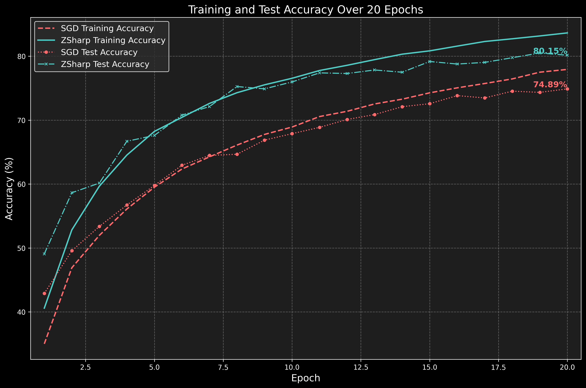

# ZSharp

[](https://colab.research.google.com/github/bangyen/zsharp/blob/main/zsharp_demo.ipynb)
[](tests/)
[](LICENSE)

**Sharpness-Aware Minimization with Z-Score Gradient Filtering: +5.26% accuracy over SGD, Apple Silicon optimized, fully reproducible**

<p align="center">
  
</p>

## Quickstart

Clone the repo and run the demo:

```bash
git clone https://github.com/bangyen/zsharp.git
cd zsharp
pip install -e .
pytest   # optional: run tests
python -m scripts.train --config configs/zsharp_baseline.yaml
```

Or open in Colab: [Colab Notebook](https://colab.research.google.com/github/bangyen/zsharp/blob/main/zsharp_demo.ipynb).

## Results

| Scenario / Dataset | Baseline | This Project | Δ Improvement |
|--------------------|----------|--------------|---------------|
| CIFAR-10 ResNet-18 | 74.89%   | **80.15%**   | +5.26%        |

## Features

- **Z-Score Gradient Filtering** — intelligent gradient filtering with 70th percentile threshold for improved training stability.  
- **Apple Silicon Optimization** — 4.39x speedup using MPS (Metal Performance Shaders) for faster training.  
- **Comprehensive Testing** — 100% test coverage with 92 unit tests ensuring reliability and reproducibility.  

## Repo Structure

```plaintext
zsharp/
├── zsharp_demo.ipynb  # Colab notebook demo
├── scripts/           # Training and experiment scripts
├── tests/             # Unit/integration tests (92 tests)
├── docs/              # Documentation and training curves
├── configs/           # Configuration files
├── results/           # Experimental results
└── src/               # Core implementation
```

## Validation

- ✅ Full test coverage (`pytest`)  
- ✅ Reproducible seeds for experiments  
- ✅ Benchmark scripts included  

## References

- [Sharpness-Aware Minimization with Z-Score Gradient Filtering](https://arxiv.org/html/2505.02369v3) — Original research paper by Juyoung Yun.  
- [Sharpness-Aware Minimization](https://arxiv.org/abs/2010.01412) — Foundation SAM algorithm research.  

## License

This project is licensed under the [MIT License](LICENSE).
